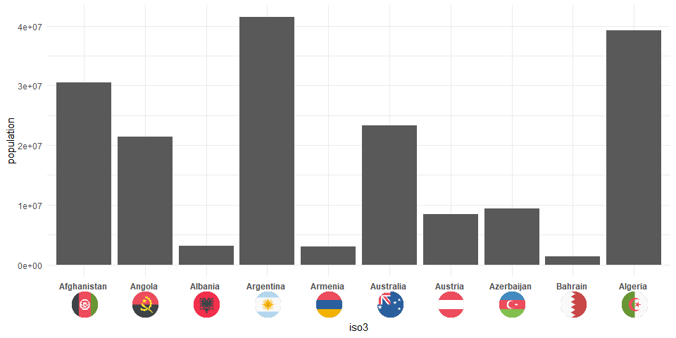

<!-- README.md is generated from README.Rmd. Please edit that file -->

# ggoxford

This is very much work in progress. I apologize for incomplete
documentation.

## Installation

You can install ggoxford from github with:

``` r
# install.packages("devtools")
devtools::install_github("schliebs/ggoxford")
```

## Example

This is a basic example of how to add country flags to bar plots:

``` r
library(tidyverse)
library(ggoxford)
library(ggtext)

wpop2013 <-
  tidyr::population %>%
  filter(year == 2013) %>%
  filter(population > 1e6) %>%
  mutate(iso3 = countrycode::countrycode(country,
                                         origin = "country.name.en",
                                         destination = "iso3c")
  ) 

head(wpop2013,10)
#> # A tibble: 10 x 4
#>    country      year population iso3 
#>    <chr>       <int>      <int> <chr>
#>  1 Afghanistan  2013   30551674 AFG  
#>  2 Albania      2013    3173271 ALB  
#>  3 Algeria      2013   39208194 DZA  
#>  4 Angola       2013   21471618 AGO  
#>  5 Argentina    2013   41446246 ARG  
#>  6 Armenia      2013    2976566 ARM  
#>  7 Australia    2013   23342553 AUS  
#>  8 Austria      2013    8495145 AUT  
#>  9 Azerbaijan   2013    9413420 AZE  
#> 10 Bahrain      2013    1332171 BHR
```

``` r
ggplot(data = wpop2013 %>%  slice(1:10),
       aes(x = iso3, y = population)) +
  geom_bar(stat = "identity") +
  theme_minimal() +
  geom_axis_flags(breaks = wpop2013$iso3,
                  labels = wpop2013$country,
                  country_icons = wpop2013$iso3,
                  width = 30,
                  lineheight = 2,
                  fontface = "bold"
                  )
```

<!-- -->

Or with a few details added (now for the last 10 countries)

``` r

set.seed(123)

ggplot(data = wpop2013 %>% sample_n(10) ,
       aes(x = iso3, y = population)) +
  geom_bar(stat = "identity") +
  geom_text(aes(label = paste0(round(population/1e6),"m")),vjust = -0.25)+
  scale_y_continuous(breaks = seq(0e6,80e6,10e6),
                     labels = scales::comma(seq(0e6,80e6,10e6))) + 
  theme_minimal() +
  labs(x = NULL,y = "Population",title = "Population in 2013")+
  geom_axis_flags(breaks = wpop2013$iso3,
                  labels = wpop2013$country, 
                  country_icons = wpop2013$iso3,
                  width = 30,
                  lineheight = 2,
                  fontface = "bold"
                  )
```

<!-- -->
